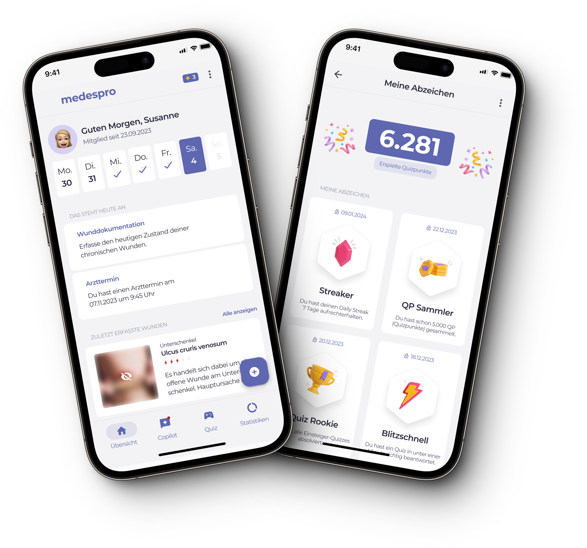
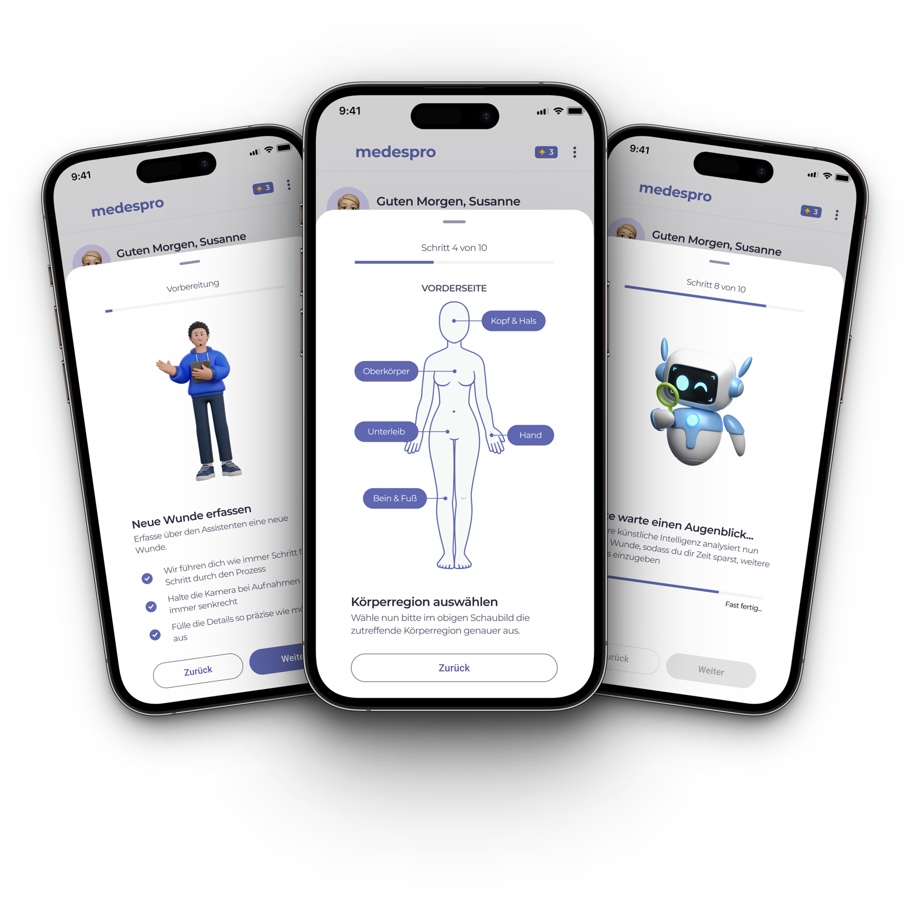
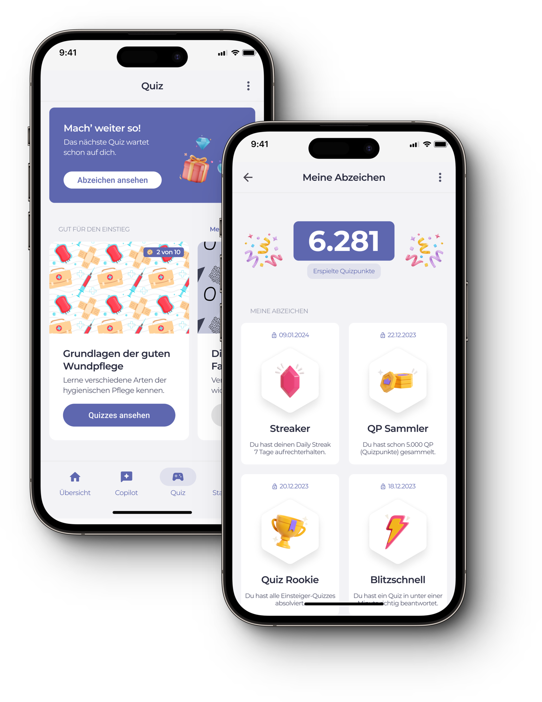

# Applikationsdesign

Entwicklung einer App in Flutter zur unterstützenden Dokumentation von chronischen
Wunden unter dem Einbezug von Gamification-Aspekten.

> Umsetzung im Rahmen einer Studienarbeit des Moduls Applikationsdesign im Wintersemester 2023/24 von Kevin Koller und Nicolas Proske mit Abgabe am 05.02.2024 bei Prof. Dr. Dieter Meiller

## 📚 Projektstruktur

- [`Dokumentation`](00_Studienarbeit/Studienarbeit_APD_Koller_Proske.pdf) mit Stand der Wissenschaft und Konzeptentwicklung

- [`Mockup`](01_Figma/Figma_APD_Koller_Proske.pdf) in Figma

- [`Quellcode`](02_Code) der Umsetzung des Mockups als interaktiven App-Prototyp in Flutter

- [`Bildschirmaufnahmen`](03_Screenrecordings) des interaktiven App-Prototyps

- [`Präsentation`](04_Präsentation/Präsentation_APD_Koller_Proske.pdf) des Zwischenstands am 25.01.2024 in Amberg

- [`Lizenzen`](05_Lizenzen) zu lizenzpflichtigen Ressourcen

## 📱 Mockup in Figma

1. Kostenlosen Account für [`Figma`](https://www.figma.com/) erstellen

2. [`Mockup`](https://www.figma.com/file/7hsIRkz3J0h9pSLHBFbUU0/App-Mockup?type=de-) in Figma öffnen

## 🕹 Interaktiver Prototyp mit Flutter

Vo­r­aus­set­zung für das Testen des App-Prototyp ist eine korrekte Installation von Flutter. Dieses [`Tutorial`](https://docs.flutter.dev/get-started/install) hilft, eine Entwicklungsumgebung aufzusetzen.

1. Repository klonen:
`git clone https://git.oth-aw.de/appdesign/appdes_24_koller_proske.git` in Terminal ausführen

2. Ordner [`02_Code`](02_Code) öffnen

3. Dependencies installieren: `flutter pub get` in Terminal ausführen

3. Datei [`lib/main.dart`](02_Code/lib/main.dart) ausführen

## ⚙️ Technische Implementierung
Dieses Projekt ist unter Verwendung von Flutter implementiert worden. Allgemein wurde bei der Implementierung darauf geachtet, weit verbreitete Konventionen wie die Bennenung von Dateien, Klassen, Variablen usw. einzuhalten.

Übergeordnete Widgets (Screens) sind im Code als `View` gekennzeichnet (z. B. [`ContentView`](02_Code/lib/views/content/content.dart)), wiederverwendbare Komponenten innerhalb von Views wiederum als `Component` (z. B. [`CardComponent`](02_Code/lib/supporting_files/components/card.dart)). Die Einführung von Komponenten ermöglicht übersichtlicheren und leichter wartbaren Code, da diese Widgets in unterschiedlichen Views verwendet werden können und so zu einem professionellerem Gesamtbild beitragen.

Es handelt sich um einen interaktiven App-Prototyp, das heißt, dass auf ein Datenmodell wie auch auf eine persistente Speicherung verzichtet worden ist. Darüber hinaus ist es nie das Ziel gewesen, eine komplett fertige App zu entwickeln. Dieser Prototyp soll lediglich die Kernkomponenten des zuvor erstellten Mockups zeigen.

Der Einstiegpunkt ist die Datei [`main.dart`](02_Code/lib/main.dart) und enthält folgende Eigenschaften:

- Verwendung von Material Design 3

- Automatisch generiertes Color Scheme basierend auf dem Farbwert [`0x5E67AF`](https://g.co/kgs/5j8zss5) (Blau-Lila)

- Standardmäßiges Light-Theme mit Möglichkeit, später ein Dark-Theme zu unterstützen

- Einheitliche Schriftart (hier Montserrat), eingebunden über [`Google Fonts`](https://pub.dev/packages/google_fonts) Dependency

Vom Einstiegpunkt ausgehend wird [`ContentView`](02_Code/lib/views/content/content.dart) aufgerufen, diese kümmert sich um:

- **Navigation:** Untere Navigationsleiste, um zwischen den verschiedenen Views zu wechseln, wie z. B. Home ([`HomeView`](02_Code/lib/views/home/home.dart)), Copilot [`CopilotView`](02_Code/lib/views/copilot/copilot.dart), Quiz ([`QuizView`](02_Code/lib/views/quiz/quiz.dart)) und Statistiken ([`StatsView`](02_Code/lib/views/stats/stats.dart)). Diese Views sind in der `_navigationItems` Liste definiert, wobei jedes Element ein [`NavigationItemModel`](02_Code/lib/views/content/models/navigation_item.dart) ist, das ein Icon, ein Label und die zugehörige View-Komponente enthält.

- **Zustandsverwaltung:** Durch die Verwendung von `setState` in der `_onDestinationSelected` Methode wird der aktuell ausgewählte Index aktualisiert, was dazu führt, dass die entsprechende View im Hauptbereich des `Scaffold` angezeigt wird.

- **Primäraktion:** Der `FloatingActionButton` öffnet ein Modal (Bottom Sheet) ausgelöst über `showModalBottomSheet` zur Erfassung neuer Wunden durch [`WoundStepFlowView`](02_Code/lib/views/wound_step_flow/wound_step_flow.dart).

Bei der Umsetzung der weiteren Views ist auf eine konsistente Implementierung geachtet worden. Widgets, die in mehreren Views verwendet werden, sind als seperate Dart-Dateien im Ordner [`lib/supporting_files/components`](02_Code/lib/supporting_files/components/) zu finden. Auf derselben Ebene befindet sich der Ordner [`images`](02_Code/lib/supporting_files/images/) mit allen Bildern, die im Code referenziert werden (siehe `assets` in [`pubspec.yaml`](02_Code/pubspec.yaml)).

Komponenten, die lediglich innerhalb einer View benötigt werden, sind im jeweiligen Ordner der View unter `components` abgelegt (z. B. [`lib/views/chat/components`](02_Code/lib/views/chat/components)). In einem View-Ordner können ebenfalls `Model`-Dateien im dazugehörigen `models`-Ordner liegen. Bei diesen Dateien handelt es sich um keine Widgets, sondern um einfache Datenmodelle (z. B. `NavigationItemModel` unter [`lib/views/content/models/navigation_item.dart`](02_Code/lib/views/content/models/navigation_item.dart) repräsentiert ein Objekt, das für die einfache Verwaltung der `NavigationBar` benötigt wird).

## 👾 Sneak Peek

## 📦 Lizenz

Diese Arbeit unterliegt den Bestimmungen einer
[Creative Commons CC BY-NC-SA 4.0 DEED (Namensnennung - Nicht-kommerziell - Weitergabe unter gleichen Bedingungen 4.0 International)](https://creativecommons.org/licenses/by-nc-sa/4.0/deed.de) Lizenz.

This work is licensed under a
[Creative Commons CC BY-NC-SA 4.0 DEED (Attribution-NonCommercial-ShareAlike 4.0 International)](https://creativecommons.org/licenses/by-nc-sa/4.0) license.

